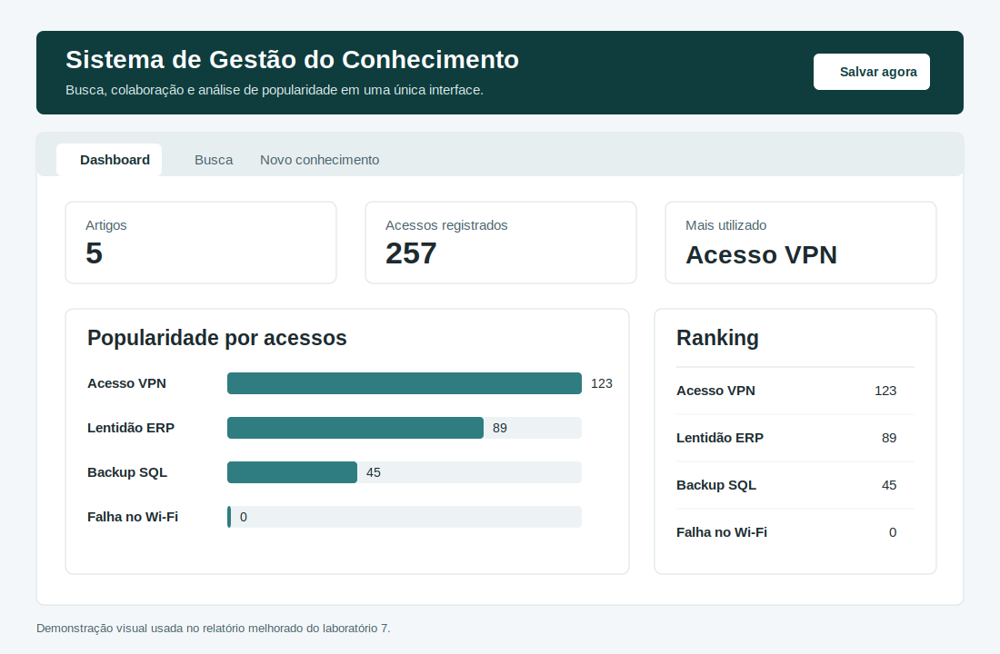

# Laboratório 7 - Sistema de Gestão do Conhecimento

## Objetivo

Implementar um protótipo de Sistema de Gestão do Conhecimento (SGC) usando arquitetura em camadas:

- Camada de dados: persistência dos artigos em JSON.
- Camada de lógica: busca case-insensitive por título e conteúdo.
- Camada de apresentação: dashboard de popularidade e interface de uso.
- Módulo de colaboração: cadastro de novos conhecimentos.

## Validação da atividade

| Requisito do roteiro | Implementação | Situação |
| --- | --- | --- |
| Busca com List Comprehension | `buscar_conhecimento` filtra título e conteúdo usando `.lower()` | Atendido |
| Busca case-insensitive | Termos como `vpn`, `VPN` e `Sql` retornam os mesmos registros esperados | Atendido |
| Dashboard textual | `exibir_dashboard` apresenta barras proporcionais aos acessos | Atendido |
| Persistência JSON | `salvar_dados` grava `base_conhecimento.json` com `json.dump` | Atendido |
| Colaboração | `criar_conhecimento` e `adicionar_conhecimento` adicionam artigos com ID automático | Atendido |

Além dos requisitos originais, a camada de dados foi ajustada para salvar e carregar o JSON sempre a partir da pasta do laboratório. Assim, o programa funciona corretamente mesmo quando executado a partir da raiz do repositório.

## Arquitetura

| Camada | Arquivo | Responsabilidade |
| --- | --- | --- |
| Dados | `dados.py` | Carregar e salvar a base de conhecimento em JSON |
| Lógica | `logica.py` | Recuperar conhecimento por termo de busca |
| Apresentação textual | `apresentacao.py` e `main.py` | Exibir menu e dashboard no terminal |
| Colaboração | `colaboracao.py` | Criar novos artigos de conhecimento |
| Interface gráfica | `interface_grafica.py` | Fornecer uma experiência visual com dashboard, busca, detalhes e cadastro |

## Interface gráfica proposta

A nova interface gráfica foi criada com Tkinter, biblioteca padrão do Python. Ela melhora a clareza da apresentação porque organiza o serviço em três áreas:

- Dashboard: métricas gerais, ranking e gráfico de barras.
- Busca: campo de pesquisa, tabela de resultados e painel de detalhes.
- Novo conhecimento: formulário para cadastrar artigos e salvar na base JSON.

Também foi incluída uma ação de "registrar acesso" no item selecionado, permitindo atualizar a popularidade sem depender de uma busca no terminal.



## Execução

Para executar o menu textual original:

```bash
python3 main.py
```

Para executar a nova interface gráfica:

```bash
python3 interface_grafica.py
```

Se os comandos forem executados a partir da raiz do repositório, use:

```bash
python3 GSI/lab7/main.py
python3 GSI/lab7/interface_grafica.py
```

## Resultado

O protótipo atende ao roteiro do laboratório e agora possui uma apresentação mais completa para demonstrar o funcionamento do SGC. A versão textual continua disponível para validação simples no terminal, enquanto a interface gráfica facilita a visualização dos indicadores de uso e a manutenção da base de conhecimento.
